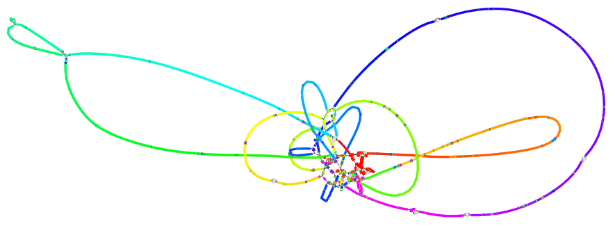
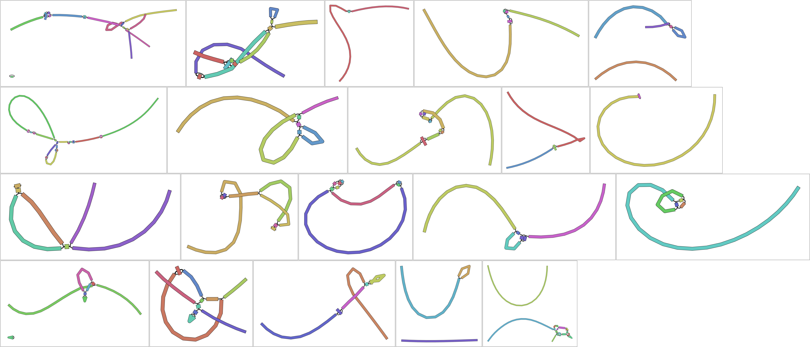
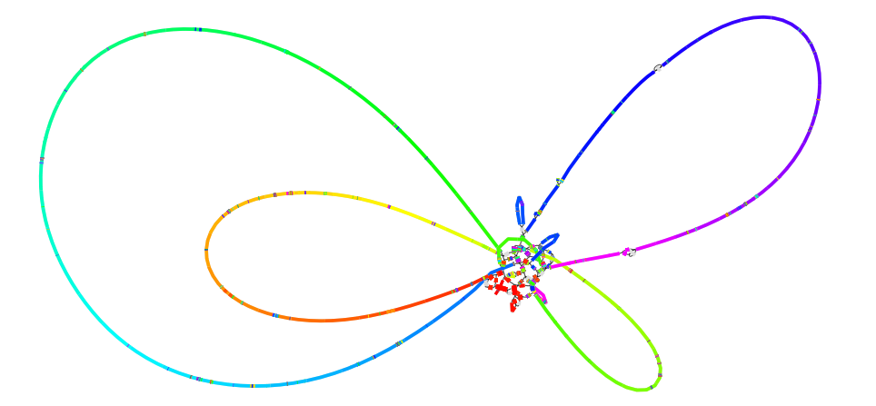
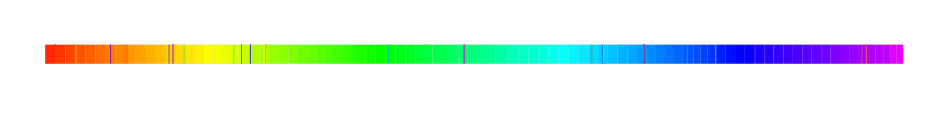

# Methods

## Assembling linked reads
First, in order to have baseline assemblies to compare against Talr, we assemble 
linked-reads using both LR-aware and non-LR-aware assemblers.
For non-LR-aware assemblers we use ARCS to generate scaffolds using linked reads.

### non-LR-aware assemblers
We assemble linked reads using three different assemblers; Unicycler, SPAdes, and ABySS. 
The example below shows how to do this:

```
make unicycler
make spades
make abyss
```
This will give us assembled genomes in FASTA format. In addition, we will get graph representation of the assemblies in GFA formats (or FASTG for SPAdes).
```
results/assemblies/f1chr4.abyss.contigs.fa
results/assemblies/f1chr4.abyss.contigs.gfa
results/assemblies/f1chr4.abyss.scaffolds.fa
results/assemblies/f1chr4.abyss.scaffolds.gfa
results/assemblies/f1chr4.spades.contigs.fa
results/assemblies/f1chr4.spades.fastg
results/assemblies/f1chr4.spades.scaffolds.fa
results/assemblies/f1chr4.unicycler.fa
results/assemblies/f1chr4.unicycler.gfa
```

We can visualize these graph formats using Bandage. For example, to visualize assemblies obtained by Unicycler we run:
```
Bandage load results/assemblies/f1chr4.unicycler.gfa
```

### Scaffolding assemblies using ARCS
One could think of improving assemblies obtained from non-LR-aware assemblers by scaffolding them using linked reads. This can be done using [ARCS](https://github.com/bcgsc/arcs) which is designed specifically to scaffold draft assemblies using linked reads. These assemblies can be obtained by running the following commands:
```
make unicycler-arcs
make spades-arcs
make abyss-arcs
```

This will give us scaffolds generated by ARCS. In this example, the list of output files is as follows:
```
results/arcs-abyss-scaffold/f1chr4.abyss.contigs.fa
results/arcs-abyss-scaffold/f1chr4.abyss.scaffolds.fa
results/arcs-abyss-scaffold/f1chr4.spades.contigs.fa
results/arcs-abyss-scaffold/f1chr4.spades.scaffolds.fa
results/arcs-abyss-scaffold/f1chr4.unicycler.fa
```

### LR-aware assemblers

# Results

## Assessment of assemblies
We can use QUAST to compare Talr with other assemblies generated above. This can be easily done using the following command:

```
make results/quast/quast-f1chr4/report.txt
```

Here is a summary of the results for `chr4` of the Fruit Fly genome.

| Assembly                  | NG50     | Quast-misassemblies |
|---------------------------|---------:|---------------------|
| ABySS                     | 53,005   | 4                   |
| SPAdes                    | 77,426   | 5                   |
| Unicycler                 | 61,681   | 5                   |
| ABySS+ARCS                | 936,628  | 10                  |
| SPAdes+ARCS               | 988,436  | 11                  |
| Unicycler+ARCS            | 322,017  | 9                   |
| Talr+SPAdes+Miniasm       | 195,672  | 6                   |
| Talr+SPAdes+Miniasm (sdj) | 160,342  | 8                   |
| Talr+Unicycler+Miniasm    | 112,721  | 7                   |
| Talr+SPAdes+Unicycler     | 254,061  | 5                   |
| Talr+SPAdes+Unicycler+ARCS| 1,126,501| 6                   |

## Unicycler (baseline)

We assembled the linked reads using Unicycler, ignoring barcodes.



## Physlr

Construct a physical map of the linked read large molecules.


## Talr and SPAdes

Extract a FASTQ file containing the reads for those barcodes found in each region. Assemble the reads of each region using SPAdes.



## Unicycler 

Assemble the short reads using Unicycler, and use all of the SPAdes contigs as "long reads".



## ARCS

Scaffold the Unicycler contigs with the linked reads using ARCS.


